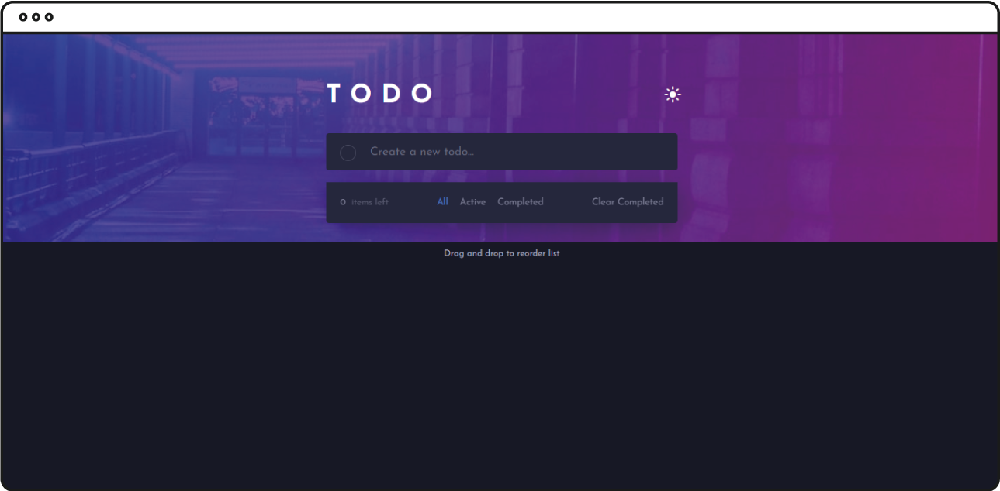
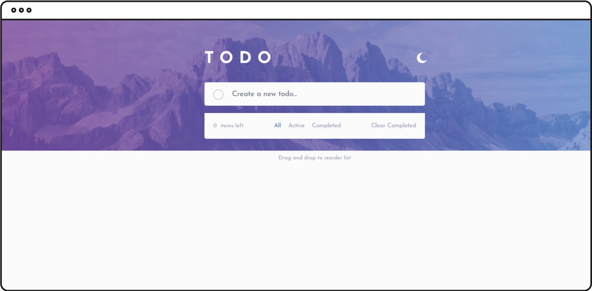
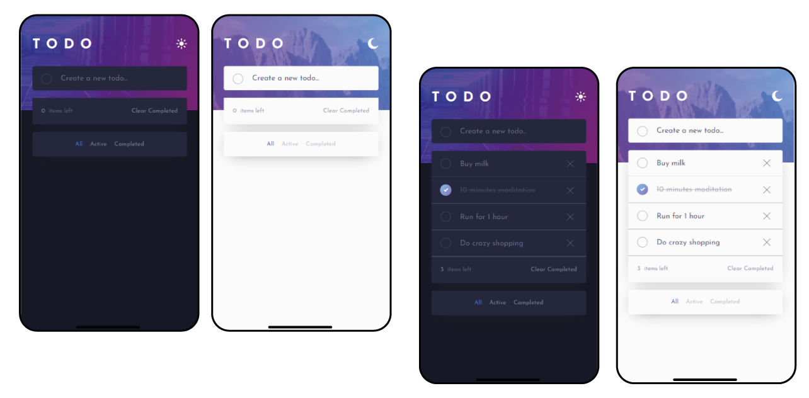
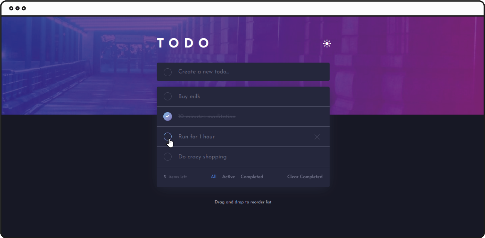
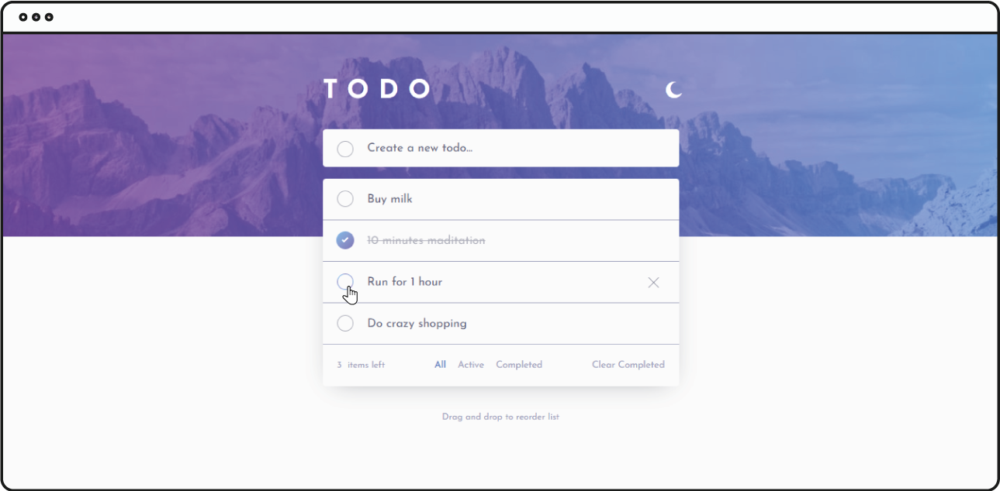

#Todo app with Vue.js

This is a solution to the [Todo app challenge on Frontend Mentor](https://www.frontendmentor.io/challenges/todo-app-Su1_KokOW).

>Live preview: https://nifty-turing-f84df9.netlify.app/

## Table of contents

- [Overview](#overview)
    - [The challenge](#the-challenge)
    - [Screenshot](#screenshot)
    - [Links](#links)
- [My process](#my-process)
    - [Built with](#built-with)
- [Author](#author)

## Overview

### The challenge

Users should be able to:

- View the optimal layout for the app depending on their device's screen size
- See hover states for all interactive elements on the page
- Add new todos to the list
- Mark todos as complete
- Delete todos from the list
- Filter by all/active/complete todos
- Clear all completed todos
- Toggle light and dark mode
- **Bonus**: Drag and drop to reorder items on the list

### Screenshot







### Links

- Live Site URL: [todo-list-vue](https://nifty-turing-f84df9.netlify.app/)

## My process

### Built with

- Semantic HTML5 markup
- CSS custom properties
- Flexbox
- CSS Grid
- SASS
- Mobile-first workflow
- Vue 3 CLI
- Vue Composition API
- Gulp (to process SASS, Icons, Fonts etc.)
- npm
- Netlify (to deploy)

## Project setup
```
npm install
```

### Compiles and hot-reloads for development
```
npm run serve
```

### Compiles and minifies for production
```
npm run build
```

### Lints and fixes files
```
npm run lint
```

## Author

- Website - [Simone Mandola](https://www.simonemandola.com)
- Frontend Mentor - [@simonemandola](https://www.frontendmentor.io/profile/simonemandola)